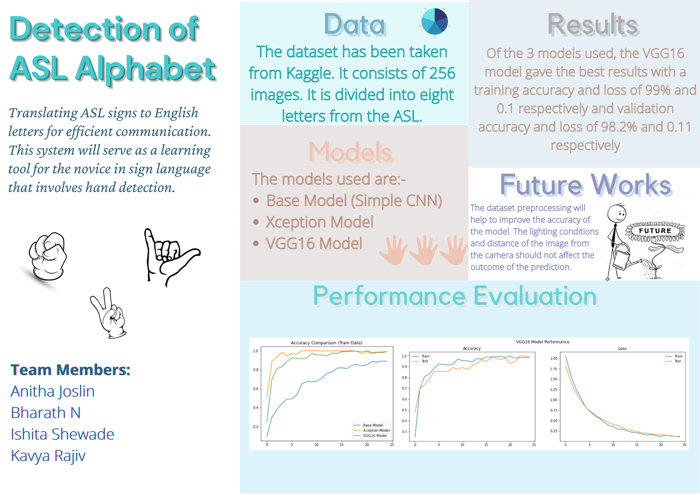

# ASL_classification

Translating ASL signs to English letters for efficient communication. This system will serve as a learning tool for the novice in sign language that involves hand detection.

# Project Overview

